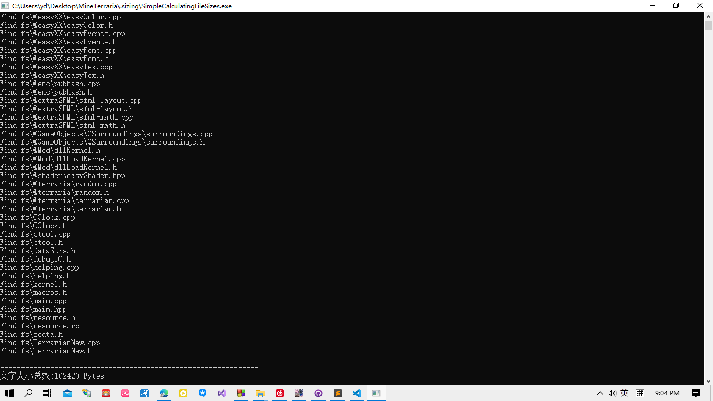
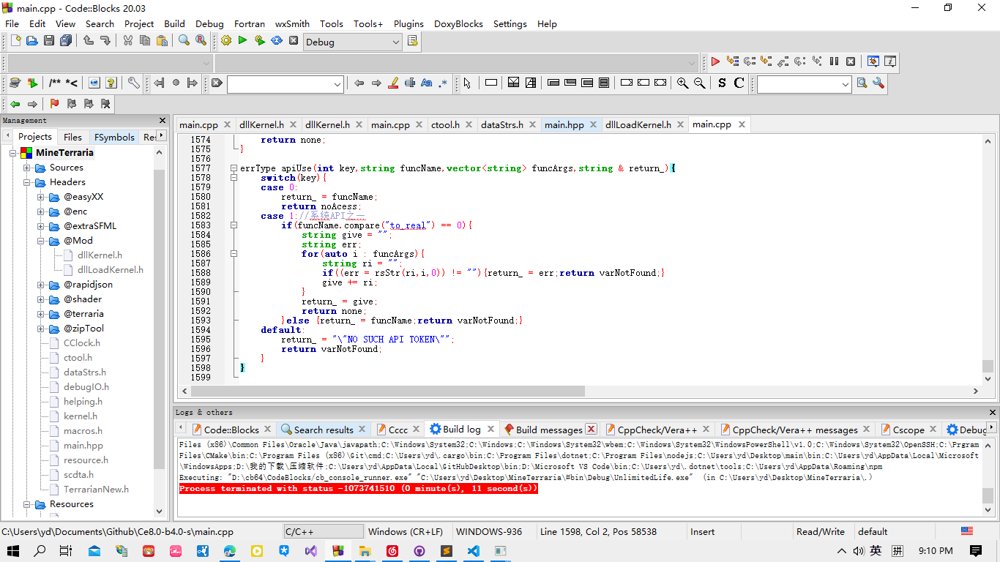

# 颓废史-0，编程使我空虚

    不知何时，编程带给我的不是无尽的快乐，而是时有时无的空虚。

    怎么说吧，我学习编程已经两年半接近三年了，中途我也接触了许多的技术，我大概统计一下自己接触的语言及技术：

* C++

  * OpenGL
    * SFML
  * DirectX
  * WindowsAPI
    * Dynamic Link Library
  * MetaNN
* C#

  * .Net Window Frame
  * Unity
* Java

  * Swing
  * Android
  * AWT
* Python

  * BeautifulSoup
* HTML
* CSS
* JavaScript

  * Canvas
  * WebGL

  该学的数据结构也学了：
* JSON
* XML

所以逐渐地，我发现自己越来越颓废，最后感觉人生坠落到了低谷，真的不知道怎么办，项目体量虽然大

总之，很无聊，且感到窒息。

今天是2022-8-29，20022-8-31又要回学校，哎！

Not cheers...
